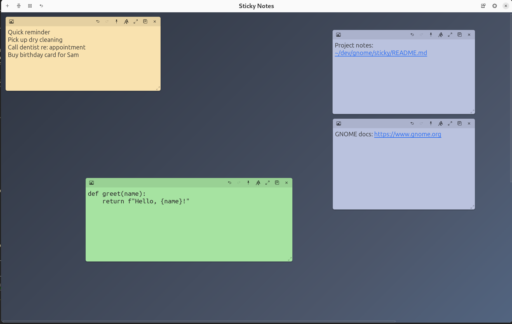
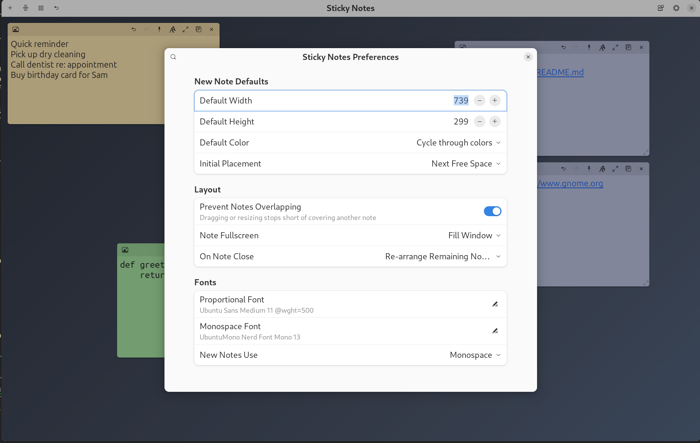
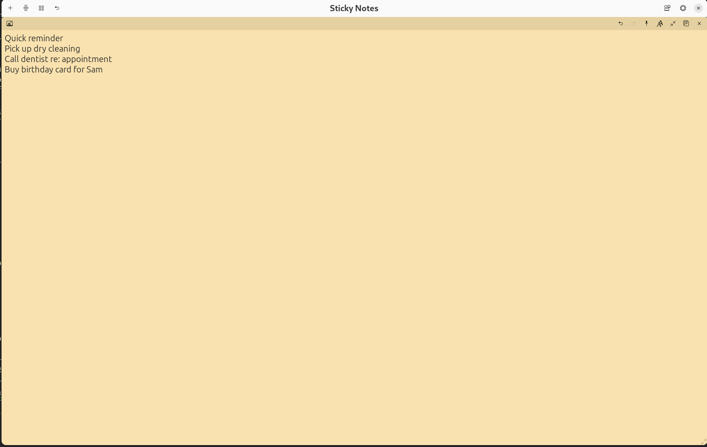
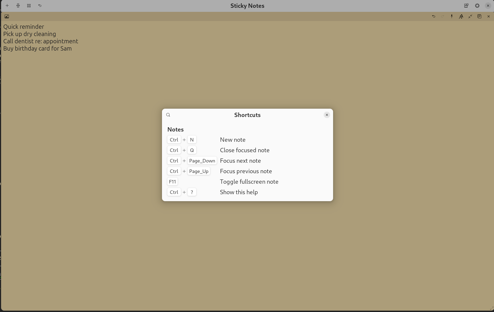

# Sticky Notes

A digital post-it notes app for GNOME. Notes live as draggable, resizable
cards on a single scrollable board window, so the whole app behaves like
one normal application in the window switcher — no per-note windows, no
Wayland window-positioning headaches.



## Features

- **Draggable, resizable notes** on a gradient board, with click-to-raise
  z-ordering and an optional "prevent overlap" mode (drag freely, then
  snap into a free grid cell on release).
- **Undo/redo** per note, plus a "Recently Closed" list (60-day retention)
  to bring back a deleted note — restoring dodges any overlap automatically.
- **Clickable links**: URLs and existing file paths typed into a note
  become clickable (a file path is only linkified if it actually exists).
- **Paste images** (Ctrl+V) directly into a note.
- **Per-note controls**: color, proportional/monospace font toggle, copy
  text to clipboard, fullscreen (fill the window or the whole screen).
- **Arrange tools**: tidy all notes into a cascade or a grid with one
  click, or set a preference to auto re-arrange into a grid whenever a
  note is closed.
- **Preferences**: default note size/color (including "cycle through
  colors" for new notes), initial placement (cascade or next free
  space), overlap prevention, note fullscreen behavior, on-close
  behavior, and separate proportional/monospace fonts.
- **Persistence**: notes (text, color, font, position, size) and
  preferences are saved automatically and restored on next launch.
- **Keyboard shortcuts** — see below, or open them in-app via the
  keyboard icon in the header bar (or `Ctrl+?`).



A note fullscreened to fill the whole screen (`F11`):



## Keyboard shortcuts

| Shortcut | Action |
|---|---|
| `Ctrl+N` | New note |
| `Ctrl+Q` | Close the currently focused note |
| `Ctrl+Page Down` / `Ctrl+Page Up` | Move focus to the next / previous note |
| `F11` | Toggle fullscreen for the focused note |
| `Ctrl+?` | Show keyboard shortcuts |



## Requirements

- GNOME / GTK 4 (tested on GTK 4.14, libadwaita 1.5, GNOME Shell 46)
- Python 3 with PyGObject (`python3-gi`, `gir1.2-gtk-4.0`, `gir1.2-adw-1`)

On Ubuntu:

```sh
sudo apt install python3-gi gir1.2-gtk-4.0 gir1.2-adw-1
```

## Running

```sh
./bin/sticky-notes
```

## Installing (so it shows up in the app grid / Alt-Tab)

```sh
mkdir -p ~/.local/share/applications ~/.local/share/icons/hicolor/scalable/apps
cp data/net.rfletcher.StickyNotes.desktop ~/.local/share/applications/
cp data/icons/net.rfletcher.StickyNotes.svg ~/.local/share/icons/hicolor/scalable/apps/
update-desktop-database ~/.local/share/applications/
```

The desktop file's `Exec` line points at this checkout's `bin/sticky-notes`
by absolute path — edit it if you move the checkout.

## Data locations

- Notes and closed-notes history: `~/.local/share/sticky-notes/notes.json`
- Preferences: `~/.config/sticky-notes/prefs.json`

## Project layout

```
bin/sticky-notes          launcher script
data/                     .desktop file and app icon
sticky_notes/
  main.py                 GApplication, CSS, keyboard shortcut accels
  board.py                the single board window: layout, drag/resize,
                           persistence, arrange/fullscreen/shortcuts logic
  note.py                 a single note card: text, undo/redo, links,
                           image paste, font/color/fullscreen controls
  prefs.py                Preferences model + JSON load/save
  prefs_ui.py              preferences window UI
```
